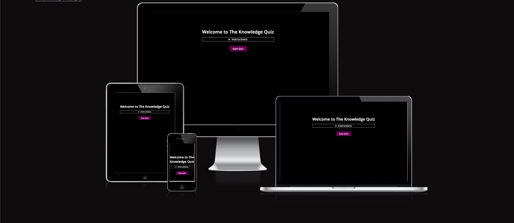
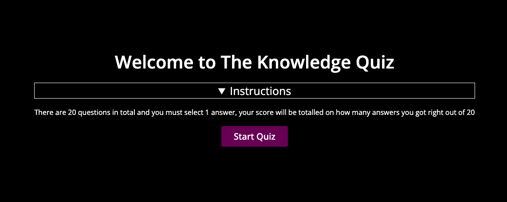
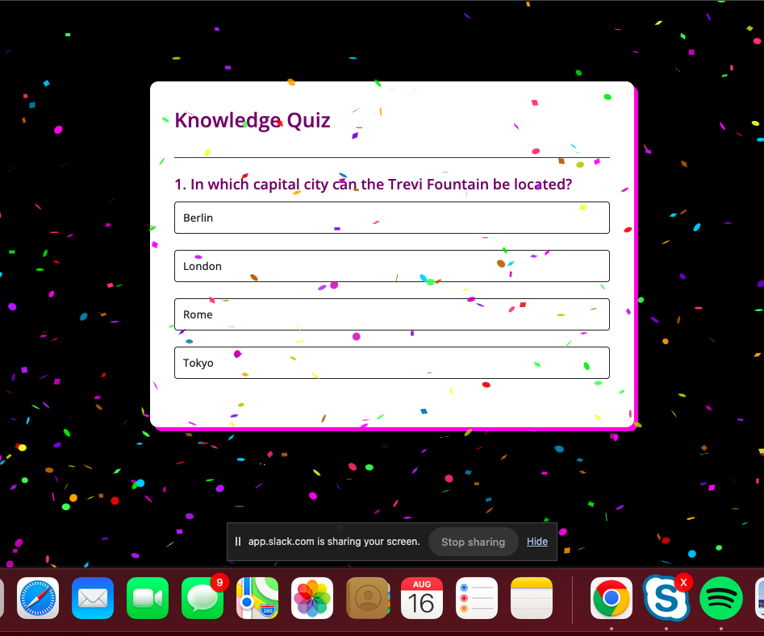
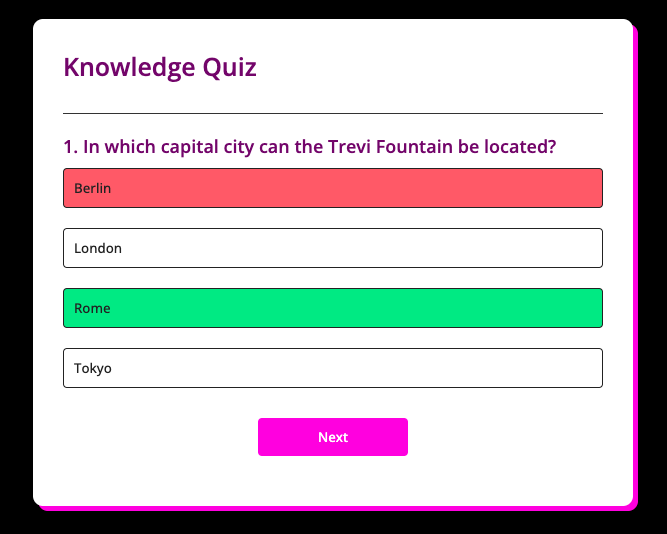
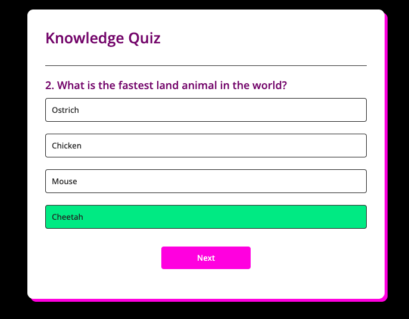
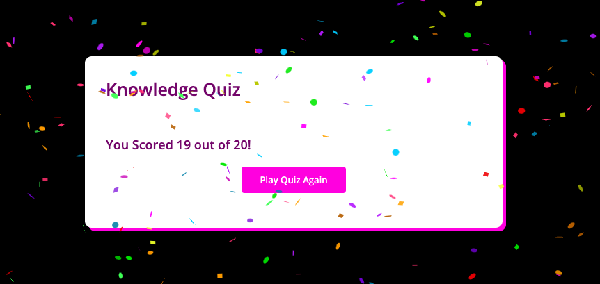

# The Knowledge Quiz 

# How does the Knowledge Quiz Work.

The Knowledge Quiz is a multiple choice quiz which tests the users general knowledge through a set of 20 questions. Each question comes with 4 multiple choice options which are represented by buttons in the app.

When the correct option is selected by the player, the answer button hilights green. If an incorrect option is selected by the player the answer button hilights red and the correct answer is hilighted in every instance once a question is answered the player progresses through the quiz scoring a point for each question they have correct. Incorrect answers do not score points. 

At the end of the quiz the players score is calculated out of 20. And they are congratulated by on screen animations to signifying that they have completed the quiz. At the start of the quiz on screen animations also are present.

The project is aimed at any age demographic who just enjoy exercising their general knowledge or who want to learn something new, just for fun. 

## Features

On the landing page which essentially is a Welcome Page we have and Introduction which is a drop down which gives basic instructions as to how to quiz works 

### Instructions

### Start Quiz Button

This button starts launches the quiz and also on launch drops confetti on the screen as a jubilant welcoming for the player.

Then the confetti drops 

### Correct/ Incorrect Answers

As mentioned earlier answers can either pushed right or wrong if the user pushes a incorrect answer the quiz will hilight the correct answer alongside the chosen wrong answer.

Example 1

Example 2

### Next Question

Once a question is answered we can proceed by clicking the Next Button at the bottom of the page.

### ShowScore and Confetti

Once the player has completed the quiz they are given a score which is their total correct responses out of 20 a confetti explosion accompanies this to evoke a positive emotion of the player finally completing the quiz.

Once the confetti subsides the player has the option to restart the quiz by clicking the PlayQuizAgain button.

# Testing

## HTML

I have passed the code through the w3c validator which returned two errors which do not appear to be effecting the live preview of the html.

[Click for results in html validator](https://validator.w3.org/nu/?showsource=yes&doc=https%3A%2F%2Fdeana1985.github.io%2FGeneral-Knowledge-Quiz---P2%2F#textarea)

## CSS

I have passed the code through the Jigsaw validator which returned no errors.
[Click for results in jigsaw validator](https://jigsaw.w3.org/css-validator/validator?uri=https%3A%2F%2Fdeana1985.github.io%2FGeneral-Knowledge-Quiz---P2%2F&profile=css3svg&usermedium=all&warning=1&vextwarning=&lang=en)

## Javascript

I have passed the code through JShint validator which returned no errors. There are 13 functions in this file.

Function with the largest signature take 2 arguments, while the median is 0.

Largest function has 8 statements in it, while the median is 4.

The most complex function has a cyclomatic complexity value of 2 while the median is 2.
